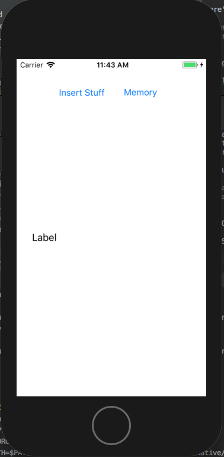
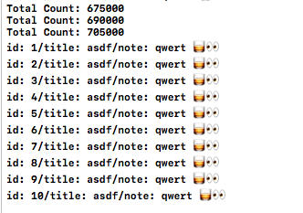

# SQLite & SQLDelight Sample

This example shows a first pass on creating a Kotlin/Native SQLite interface and common interface that is a stand in for Android's
SQLite stack. It also includes SQLDelight's Kotlin Common source gen which allows multiplatform database development.

## Notes

This is super, super early. The app does nothing except insert and query a bunch of data. Some of the architecture needs a rethink 
due to the threading model of Kotlin/Native. All the rest of the notes in [blog post](https://medium.com/@kpgalligan/sqlite-sqldelight-%EF%B8%8F-kotlin-multiplatform-f24fe7cba338)/video.

## Building

Right now (11:19am Friday) the Android app compiles but won't actually do anything. May fix but that's not the interesting part of
the demo, and I promised to publish this by today, so priorities.

1: Clone Kotlin/Native: https://github.com/JetBrains/kotlin-native.

2: Modify some source in Kotlin/Native. I've filed [an issue](https://github.com/JetBrains/kotlin-native/issues/1539), 
but for now, you need to remove the check code. Open the file:
```
backend.native/compiler/ir/backend.native/src/org/jetbrains/kotlin/backend/konan/lower/InteropLowering.kt
```

Comment out a block starting at line 521 (example below starts at 519 for context).

```kotlin
            val initMethod = expression.descriptor.getObjCInitMethod()!!

            /*if (!expression.descriptor.objCConstructorIsDesignated()) {
                context.reportCompilationError(
                        "Unable to call non-designated initializer as super constructor",
                        currentFile,
                        expression
                )
            }*/

            val initMethodInfo = initMethod.getExternalObjCMethodInfo()!!
```

3: Run the Kotlin/Native build steps:
```bash
./gradlew dependencies:update
./gradlew bundle
```

3a: Optional, but poke around some of the samples and make sure they work. The 'calculator' samples specifically. This is 
built on that.

4: Add that dir to your environment variables (I put in ~/.bash_profile)
```
export KOTLIN_NATIVE_DIR=[Your path]
```

5: Download [J2objc 2.1.1](https://github.com/google/j2objc/releases/tag/2.1.1). Unzip to a local path. If you're not the
self sabotaging type, I'd suggest a path with no spaces.

6: Add that to environment variables
```
export J2OBJC_RUNTIME=[unzip path]
```

### Sanity Check!

Here's my ~/.bash_profile
```
export J2OBJC_RUNTIME=/Users/kgalligan/bin/j2objc-2.1.1
export KOTLIN_NATIVE_DIR=/Users/kgalligan/temp2/kotlin-native
```

I didn't mention it above, but you've got Xcode installed and you've built a few things with it. Especially something 
that will force the command line tools to be installed. If you haven't done options step 3a above, I'd say do it. Really 
shouldn't be optional.

### More Steps

7: Open Intellij and open this sample project in it. **Intellij**, not Android Studio. Might be OK, but haven't tried.

8: Manually run the task to generate the SQLDelight interfaces: generateSqlDelightInterface. I've been running that from the Gradle UI
":notepad>Tasks>sqldelight>generateSqlDelightInterface". Verify that those are built by looking in notepad/build/sqldelight. If not, 
you're probably not getting to the next steps.

9: Build the ios app specifically.

```bash
./gradlew :notepad:ios:build
```

10: Open the Xcode project. It's in 'notepad/ios'. Open 'calculator.xcodeproj' (For the non-Xcode crowd, it's a folder, but sort of not really)

11: Select a simulator profile, and run. It'll take *a while*. When it's done, you should see the following.



There are 2 buttons and a label. The "Insert Stuff" button will run the shared code found in: 

```
notepad/src/main/kotlin/co/touchlab/kurgan/play/notepad/Methods.kt
```

This creates the database, then schedules 3 inserts of 15000 rows each, followed by a select of 10 rows. All is written to
the console output, which should look like this.



What does "Memory" button do? Well, you'll need to learn how Kotlin/Native handles memory to fully understand, but it 
runs the insert loops and only cleans up memory at the end of it, as opposed to the first button with cleans on each loop.
If you're interested, open the project in Instruments and open in "Leaks" profile. The first button will be flat. Second will 
have a sawtooth. Not super important for the demo, but interesting.

## FAQ

Q: Can I try this in my app?
A: Sure, but don't.

Q: Where's the SQLite source?
A: Well, I've learned quite a bit about Kotlin/Native architecture and threads, and there's some refactoring that's needed anyway. For example, 
you can get a blob from results, but can't pass one to a query. I'll have another release in a few weeks with other bits. The actual SQLite 
code is from Doppl, so you can see that [here](https://doppllib.github.io/).

Q: The generated SQLDelight isn't compiling!
A: SQLdelight with Kotlin is being heavily developed, and to get the Kotlin/Native build, I need source, so the runtime is copy/pasted, but
the generator code is looking at a SNAPSHOT. If that's been updated, it might break (it did for me 2 hours before my talk). Ping me on 
twitter at [@kpgalligan](https://twitter.com/kpgalligan) if this is happening and I'll republish.

